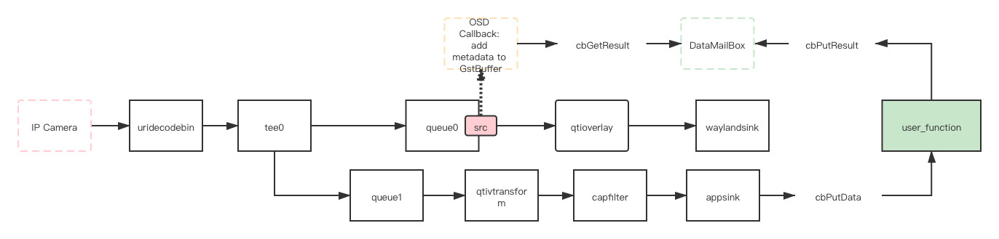

# GstPadProbe

在[GStreamer-APP](https://ricardolu.gitbook.io/gstreamer/application-development/app)章节讲到了应用程序和GStreamer pipeline进行数据方式的一种方式，并且在示例中，使用`appsink`完成了从pipeline中取图像数据绘制，并把绘制后的图像经由`appsrc`重新送回pipeline中，这是目前基于GStreamer框架开发的应用程序最简单的一种架构。但是需要注意的是这里的`appsink`和`appsrc`实际上是两条pipeline，使用起来非常麻烦。在这篇教程中我将展示如何使用类似于[Basic tutorial 7: Multithreading and Pad Availability](https://ricardolu.gitbook.io/gstreamer/basic-theory/basic-tutorial-7-multithreading-and-pad-availability)中一样的example pipeline来实现相同的目标。

## GstPadProbe

GstElement实际是通过GstPad完成连接，这是一种非常轻量的原始链接点。数据在GstPad之间进行传递，

### gst_pad_add_probe()

```c
gulong
gst_pad_add_probe (GstPad * pad,
                   GstPadProbeType mask,
                   GstPadProbeCallback callback,
                   gpointer user_data,
                   GDestroyNotify destroy_data)
```

在pad状态发生改变的时候发出通知，为匹配掩码的每个状态调用提供的回调函数。

`pad`：添加probe的GstPad

`mask`：probe的掩码，详细参考[GstPadProbeType](https://gstreamer.freedesktop.org/documentation/gstreamer/gstpad.html?gi-language=c#GstPadProbeType)

`callback`：回调函数指针

`user_data`：用户传递给回调的数据

`destroy_data`：

返回值是一个无符号整型id，用于标识probe，`gst_pad_remove_probe()`释放probe用.

### GstPadProbeCallback

```c
GstPadProbeReturn
(*GstPadProbeCallback) (GstPad * pad,
                        GstPadProbeInfo * info,
                        gpointer user_data)
```

pad的对应状态下调用的probe回调函数，可以修改`info`指向的数据。

### GstPadProbeInfo

```c
struct _GstPadProbeInfo
{
  GstPadProbeType type;
  gulong id;
  gpointer data;
  guint64 offset;
  guint size;

  /*< private >*/
  union {
    gpointer _gst_reserved[GST_PADDING];
    struct {
      GstFlowReturn flow_ret;
    } abi;
  } ABI;
};
```

`data`根据不同的probe type具有不同的类型，可以直接操作`data`指针，也可以通过GstPadProbeInfo提供的借口获取其下的数据。常用的有`gst_pad_probe_info_get_buffer（）`，用于获取经过pad的GstBuffer。

## Pipeline

### Overview



在[GStreamer-APP](https://ricardolu.gitbook.io/gstreamer/application-development/app)教程的实例中，我们通过`appsink`将GstBuffer传递到用户空间然后使用OpenCV绘制了一个红色的矩形框和appsink字符串，并且通过`appsrc`的回调中绘制了一个绿色的矩形框和appsrc字符串，最后将绘制后的cv::Mat转为GstBuffer送回pipeline中并用`waylandsink`显示在屏幕上。

开头说过，`appsink`和`appsrc`各为一条pipeline，为了程序的正常运行，需要用户自行维护两条pipeline的数据同步，这是一个令人头疼的问题，并且为了画图总共发生了两次内存拷贝，这在应用中将占用一部分CPU性能。在本教程中，我们通过在`queue0`的`src pad`中注册一个`GST_PAD_PROBE_TYPE_BUFFER`类型的probe回调，取出经过`queue0`的GstBuffer并将要绘制的内容直接加到该buffer的metadata中，使用`qtioverlay`完成了相关内容的绘制。

### qtioverlay

`qtioverlay`是高通平台上的一个Overlay插件，内部依赖`metadata`调用C2D库完成了在`NV12`图像上bounding box和一个简单的bbox text的绘制，为了支持动态修改overlay color，我为其添加了一个`meta-color`的property，有关修改和使用的详情请阅读[Qualcomm-gst-plugin: qtioverlay](https://ricardolu.gitbook.io/gstreamer/qualcomm-gstreamer-plugins/qtioverlay)。

**注：**假如只需要在`NV12`图像上画矩形框，[draw-yuv-rectangle](https://github.com/gesanqiu/draw-rectangle-on-YUV)库实现了相同的功能。

## Issue

### tee的request-pad

在[Basic tutorial 7: Multithreading and Pad Availability](https://ricardolu.gitbook.io/gstreamer/basic-theory/basic-tutorial-7-multithreading-and-pad-availability)中使用了`gst_element_request_pad_simple()`向`tee`请求生成的`src-pad`，并且使用`gst_element_release_request_pad()`释放请求的GstPad。

```c
GstPad *
gst_element_request_pad_simple (GstElement * element,
                                const gchar * name)
```

但是需要注意的是`gst_element_request_pad_simple()`是在GStreamer-1.20之后才引入的新特性，旧的版本应该使用`gst_element_get_request_pad()`来申请。

### GstBuffer isn't writable

- `cb_queue0_probe()`

```shell
(GstPadProbe:9069): GStreamer-CRITICAL **: 14:05:03.871: gst_buffer_add_meta: assertion 'gst_buffer_is_writable (buffer)' failed
```

1. 等待GstBuffer同步

   在[Buffers not writable after tee](https://gitlab.freedesktop.org/gstreamer/gstreamer/-/issues/609)这个关于`tee`的issue中提到：

   > If there are multiple references to a single buffer, writing while another thread may be reading results in data corruption.
   >
   > 假如传递的buffer存在多个引用，在一个线程读buffer的同时在另一个线程中执行写buffer操作会引起竞争。

   这句话的核心在于pipeline的多个分支线程中维护的其实是同一个buffer的不同引用，这是建立在`tee`插件只做了浅拷贝而不是深拷贝的基础上的，官方对于`tee`的说明其实比较含糊，只提到`Split data to multiple pads. `用的是split而不是copy也不是reference，所以我也并不确定`tee`的底层机制。

   假如基于`tee`只是增加引用计数的思路来考虑，这就意味着display branch和appsink branch使用的是同一个GstBuffer的不同引用，也就是当`cb_queue0_probe()`请求访问probe buffer的时候，`qtivtransform`有可能正在对这个buffer进行读写操作，这时候为了线程安全自然应该上锁，所以probe buffer不可写。

   因此我的解决思路是给`qtivtransform`的`src-pad`也加一个probe，当GstBuffer到达`src-pad`时说明`qtivtransform`的操作已经完成，这时进行一个unlock通知`cb_queue0_probe`取buffer并进行相关操作即可。

```c
    // sync
    if (info->type & GST_PAD_PROBE_TYPE_BUFFER && !vp->isExited) {
        g_mutex_lock (&vp->m_syncMuxtex);
        while (g_atomic_int_get (&vp->m_syncCount) <= 0)
            g_cond_wait (&vp->m_syncCondition, &vp->m_syncMuxtex);
        if (!g_atomic_int_dec_and_test (&vp->m_syncCount)) {
            //LOG_INFO_MSG ("m_syncCount:%d/%d", vp->m_syncCount,
            //    vp->pipeline_id_);
        }
        g_mutex_unlock (&vp->m_syncMuxtex);
    }

    // osd the result
    if (vp->m_getResultFunc) {
        const std::shared_ptr<cv::Rect> result =
            vp->m_getResultFunc (vp->m_getResultArgs);
        if (result && vp->m_procDataFunc) {
            vp->m_procDataFunc (buffer, result);
        }
    }
```

2. `gst_buffer_make_writable()`

   查看GstBffer文档可以知道，我们还可以通过`gst_buffer_make_writable()`来拷贝一份buffer，使得buffer可写，而且假如原buffer已经可写，那么这个调用只是简单的返回，拷贝并不会发生，因此不会造成过多的性能损耗。

   buffer操作完之后再使用`gst_pad_push()`将buffer传递给与`srd pad`连接的下一个插件的`sink pad`中即可。

   ```c++
       buffer = gst_buffer_make_writable (buffer);
   
       // osd the result
       if (vp->m_getResultFunc) {
           const std::shared_ptr<cv::Rect> result =
               vp->m_getResultFunc (vp->m_getResultArgs);
           if (result && vp->m_procDataFunc) {
               vp->m_procDataFunc (buffer, result);
           }
       }
   
       gst_pad_push (pad, buffer);
   ```

## Summary

至此我相信读者已经具备了开发自己的pipeline的能力，作为一个嵌入式平台的开发者，性能永远是第一目标，因此在实际使用中pipeline的架构需要反复斟酌优化。事实上通过GStreamer-APP和GstPadProbe两个例子，应该已经具备了初步的优化意识，关于架构优化，欢迎读者按顺序阅读下面三个repo的README，它记录了我基于GStreamer框架下的一个yolov3物体识别算法视频应用的从诞生到完善的完整流程：

[Ericsson-Yolov3-SNPE](https://github.com/gesanqiu/Ericsson-Yolov3-SNPE)

[Gst-AIDemo-Optimize](https://github.com/gesanqiu/Gst-AIDemo-Optimize)

[yolov3-thread-pool](https://github.com/gesanqiu/yolov3-thread-pool)

希望能给各位一些启发。

