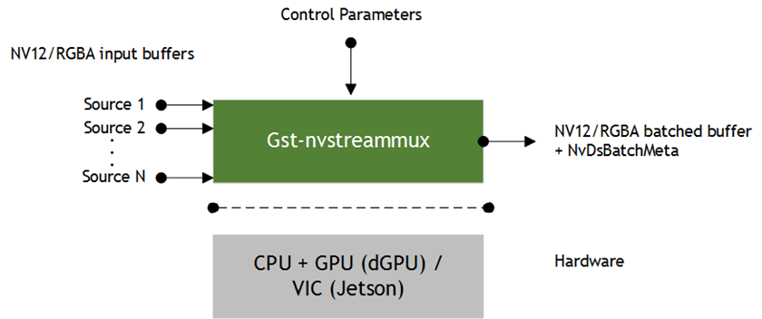

# DeepStream学习拾遗

## nvstreammux



`nvstreammux`插件能够接收多个输入源数据，将他们组成一个batch buffer并附加上一个NvDsBatchMeta数据结构输出。


在连接时由于无法预知source的信息，因此`nvstreammux`的`sink-pad`是使用`gst_element_request_pad()`动态生成的因此在link插件进行negotiation时必须要使用`gst_element_get_request_pad()`来获取新生成的pad进行连接。

## memType for dGPU

### NvBufSurfaceMemType

根据DeepStram SDK API Reference中的[NvBufSurfaceMemType](https://docs.nvidia.com/metropolis/deepstream/4.0/dev-guide/DeepStream_Development_Guide/baggage/group__ee__nvbufsurface.html#ga2832a9d266a0002a0d1bd8c0df37625b)可以知道在DeepStream中总共有7种memory，分别对应两个dGPU和Jetson两个平台的4种内存：system memory，host memory，device memory，unified memory(default memory为对应平台的device memory)。

其中system memory就是普通的CPU内存，在语言层面由malloc/free管理。

剩下三种都是Nvidia针对CPU和GPU相互进行数据传递设计的内存管理机制：

1）Pinned memory(host memory)

CUDA提供了一系列Memory Management API，在早先的开发中为了完成CPU和GPU之间的数据传递我们需要进行大量的显式内存分配和拷贝工作。由于对于device(GPU)的malloc/free的运行开销非常大，因此更常用的做法是通过`cudaMemcpy()`接口完成两者之间数据的交互，尽可能复用已申请的device内存。

同时由于虚拟内存机制的存在，host memory在malloc之后直到被访问才会去触发一个page fault操作来申请真正的物理内存，这是OS决定的。因为CPU和GPU通过PCI-E总线进行连接通信，因此GPU无法控制pageable memory的分配和转移的时机，所以在申请device memory的时候，我们需要先进行一个数据预取的操作——CUDA驱动程序首先分配一个临时的locked-page，将主机数据复制到locked-page，然后将数据从locked-page传输到device memory，如下图所示：


为了节省这次页表拷贝的开销，Nvidia设计了一种Pinned memory，pinned的含义是page-locked或non- pageable，这块内存是单独划分出来，能够被device直接访问的特殊内存，因此相对于pageable memory具有更高的带宽，但是由于占用了虚拟内存，过度使用会影响虚拟内存性能。Pinned Memory比pageable Memory的分配操作更加昂贵，但是他对大数据的传输有很好的表现。

2）Device memory：

Device memory简单理解就是GPU内存，可以通过`cudaMalloc()`接口来申请。

频繁的进行memcpy对于追求性能的开发者来说是不可忍受的，因此CUDA还提供了一种zero-copy机制，用于内存减少拷贝的次数，避免device和host之间显式的数据传输。其本质就是将将pinned memory映射到device的地址空间：

```c++
__host__ cudaError_t cudaHostAlloc ( void** pHost, size_t size, unsigned int  flags )
```

`flags`为以下几个选项：

- `cudaHostAllocDefault`：`cudaHostAlloc()`和`cudaMallocHost()`等价，申请的是pinned memory。
- `cudaHostAllocPortable`：分配的pinned memory对所有CUDA context都有效，而不是单单执行分配此操作的那个context或者说线程。
- `cudaHostAllocWriteCombined`：在特殊系统配置情况下使用的，这块pinned memory在PCIE上的传输更快，但是对于host自己来说，却没什么效率。所以该选项一般用来让host去写，然后device读。
- `cudaHostAllocMapped`：返回一个标准的zero-copy momery。可以用`cudaHostGetDevicePointer()`来获取device端的地址，从而直接操作device memory。

> 使用zero-copy memory来作为device memory的读写很频繁的那部分的补充是很不明智的，pinned这一类适合大数据传输，不适合频繁的操作，究其根本原因还是GPU和CPU之间低的可怜的传输速度，甚至，频繁读写情况下，zero-copy表现比global memory也要差不少。

当使用zero-copy来共享host和device数据时，我们必须同步Memory的获取，否则，device和host同时访问该Memory会导致未定义行为。

3）Ucnified memory

Unified memory是CUDA 6.0引入的新特性，如前文所说，在CUDA 6.0之前，程序员必须在CPU和GPU两端都进行内存分配，并不断地进行手动copy，来保证两端的内存一致。

Unified memory在程序员的视角中，维护了一个统一的内存池，在CPU与GPU中共享。使用了单一指针进行托管内存，由系统来自动地进行内存迁移。

Unified memory简化了代码编写和内存模型，可以在CPU端和GPU端共用一个指针，不用单独各自分配空间。方便管理，减少了代码量，这种代码量的减少在类对象的拷贝上体现的尤为明显。

需要表明的一点是unified memroy依赖于unified virtual addressing(UMA)，并且在实现上与zero-copy相似，所有的copy工作都在runtime阶段再处理，对程序员透明。关于UMA并没有进行过多的了解，简单来说就是CPU和GPU使用同一块连续的地址空间。

### mapping of memory type(0) not supported.

知道了这几点之后再来看我前几天在映射上遇到的问题，我在Nvidia的developer forum上提了一个[issue](https://forums.developer.nvidia.com/t/nvbufsurface-mapping-of-memory-type-0-not-supported-on-tesla-4-dgpu/193977)，moderator其实给我提供了一个思路让我去查看插件的内存类型属性的设置，我最终也根据这点发现了问题所在。但假如我们提前了解了Nvidia平台相关的内存管理模型，那么这个问题的解决思路将显而易见：

根据log可以知道我取出的NvBufSurface的memType是0——NVBUF_MEM_DEFAULT，对于dGPU来说那么就是device memory，根据`NvBufSurfaceMap()`的说明可以知道它对于dGPU仅支持NVBUF_MEM_CUDA_UNIFIED，因此可以查看各个DeepStream插件的memory type相关的属性设置情况，最后发现nvcideoconvert的nvbuf-memory-type属性默认值是0[NVBUF_MEM_DEFAULT]而不是3[NVBUF_MEM_UNIFIED]，在我修改pipeline中该插件的默认值之后成功map并且完成对frame data的读写操作。

## osd的几种思路

### nvdsosd

作为一名基于GStreamer框架进行AI算法应用开发的工程师最常遇到的问题之一就是如何将AI算法的输出可视化，DeepStream提供了一个用于OSD的插件nvdsosd，具体使用可以参考我写的使用文档：[nvdsosd](https://ricardolu.gitbook.io/gstreamer/deepstream/nvdsosd)。

### NV12

使用nvdsosd进行OSD的限制在于它的输入是RGBA格式，而编解码器通常只能处理YUV(NV12)格式的数据，因此在使用时需要使用nvvideoconvert进行格式转换，这其实会带来一部分性能损耗，因此还可以直接在解码出的NV12图像上OSD，只不过目前并没有什么图形库提供了全面的在NV12上进行OSD的API，我所实现的[draw-rectangle-on-YUV](https://github.com/gesanqiu/draw-rectangle-on-YUV)库只支持绘制line和rectangle。

想要在解码出的NV12上进行OSD需要解决一下几个问题：

- 如何map: gst_buffer_map->NvBufSurface
- GstBuffer的stride->NvBufSurface->surfacelistp[frame_meta->batch_id].pitch
- NvBufSurface: how to extrace data form a NvBufSurface structure

DeepStream提供了现成的API用来访问其封装的NvBufSurface数据：

```c++
{
    NvBufSurface *surface = NULL;
    NvDsMetaList *l_frame = NULL;
    NvDsBatchMeta *batch_meta = gst_buffer_get_nvds_batch_meta(buffer);

    // VideoPipeline* vp = (VideoPipeline*) user_data;

    GstMapInfo info;
    if (!gst_buffer_map(buffer, &info,
        (GstMapFlags) (GST_MAP_READ | GST_MAP_WRITE))) {
        TS_WARN_MSG_V ("WHY? WHAT PROBLEM ABOUT SYNC?");
        gst_buffer_unmap(buffer, &info);
        return;
    }

    surface = (NvBufSurface *) info.data;
    TS_INFO_MSG_V ("surface type: %d", surface->memType);

    uint32_t frame_width, frame_height, frame_pitch;
    for (l_frame = batch_meta->frame_meta_list; l_frame != NULL;
            l_frame = l_frame->next) {
        NvDsFrameMeta *frame_meta = (NvDsFrameMeta *)(l_frame->data);
        frame_width = surface->surfaceList[frame_meta->batch_id].width;
        frame_height = surface->surfaceList[frame_meta->batch_id].height;
        frame_pitch = surface->surfaceList[frame_meta->batch_id].pitch;

        if (NvBufSurfaceMap (surface, 0, 0, NVBUF_MAP_READ_WRITE)) {
            TS_ERR_MSG_V ("NVMM map failed.");
            return ;
        }

        // cv::Mat tmpMat(frame_height, frame_width, CV_8UC4,
        //             surface->surfaceList[frame_meta->batch_id].mappedAddr.addr[0],
        //             frame_picth);

        // std::vector<TsOsdObject> oos = jobject->GetOsdObject();
        // for (size_t i = 0; i < oos.size(); i++) {
        //     if (oos[i].x_>=0 && oos[i].w_>0 && (oos[i].x_+oos[i].w_)<frame_width &&
        //         oos[i].y_>=0 && oos[i].h_>0 && (oos[i].y_+oos[i].h_)<frame_height) {

        //         cv::Rect rect (oos[i].x_, oos[i].y_, oos[i].w_, oos[i].h_);
        //         cv::Scalar color (oos[i].r_, oos[i].g_, oos[i].b_);

        //         cv::rectangle(tmpMat, rect, color, 20);
        //     }
        // }

        YUVImgInfo m_YUVImgInfo;
        m_YUVImgInfo.imgdata = reinterpret_cast<uint8_t*>
            (surface->surfaceList[frame_meta->batch_id].mappedAddr.addr[0]);
        m_YUVImgInfo.width = frame_pitch;
        m_YUVImgInfo.height = frame_height;
        m_YUVImgInfo.yuvType = TYPE_YUV420SP_NV12;

        std::vector<TsOsdObject> oos = jobject->GetOsdObject();

        for (size_t i = 0; i < oos.size(); i++) {
            if (oos[i].x_>=0 && oos[i].w_>0 && (oos[i].x_+oos[i].w_)<frame_width &&
                oos[i].y_>=0 && oos[i].h_>0 && (oos[i].y_+oos[i].h_)<frame_height) {
                unsigned char R = oos[i].r_, G = oos[i].g_, B = oos[i].b_;
                unsigned char Y = 0.257*R + 0.504*G + 0.098*B +  16;
                unsigned char U =-0.148*R - 0.291*G + 0.439*B + 128;
                unsigned char V = 0.439*R - 0.368*G - 0.071*B + 128;
                YUVPixColor m_Color = {Y, U, V};

                YUVRectangle m_Rect;
                m_Rect.x = oos[i].x_;
                m_Rect.y = oos[i].y_;
                m_Rect.width = oos[i].w_;
                m_Rect.height = oos[i].h_;

                drawRectangle(&m_YUVImgInfo, m_Rect, m_Color, 20);
            }
        }
    }

    NvBufSurfaceUnMap (surface, 0, 0);
    gst_buffer_unmap(buffer, &info);
}
```

具体可以参考我的开源仓库[reid](https://github.com/gesanqiu/reid)中的spl中test程序的实现。

### OpenCV

除了上述两种方法，还可以直接使用OpenCV在RGBA上进行绘制。

## 参考资料

- [CUDA Toolkit Runtime API--Memory Management](https://docs.nvidia.com/cuda/cuda-runtime-api/group__CUDART__MEMORY.html#group__CUDART__MEMORY_1gc00502b44e5f1bdc0b424487ebb08db0)
- [DeepStream Plugin Guide](https://docs.nvidia.com/metropolis/deepstream/dev-guide/text/DS_plugin_gst-nvstreammux.html)
- [Nvidia DeepStream SDK API Reference](https://docs.nvidia.com/metropolis/deepstream/4.0/dev-guide/DeepStream_Development_Guide/baggage/structNvBufSurface.html)
- [Pinned memory of CUDA](https://developer.nvidia.com/blog/how-optimize-data-transfers-cuda-cc/)
- [Unified memory of CUDA](https://developer.nvidia.com/blog/unified-memory-in-cuda-6/)
- DeepStream get-dsexample plugin: 插件源码位于`/opt/nvidia/deepstream/deepstream-6.0/sources/gst-plugins/gst-dsexample`

