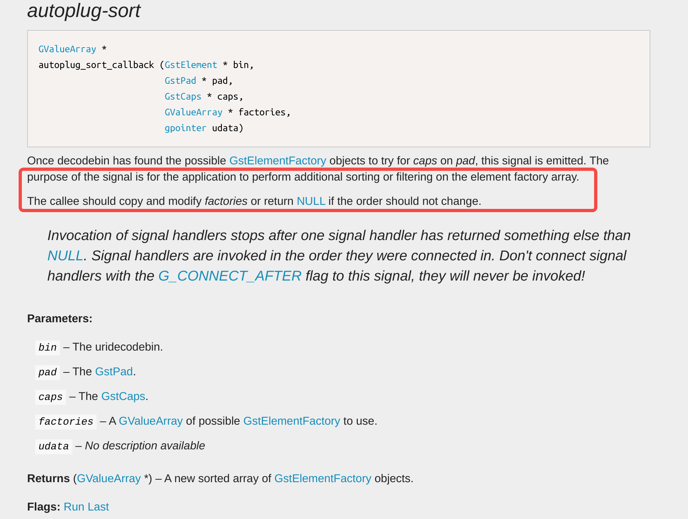
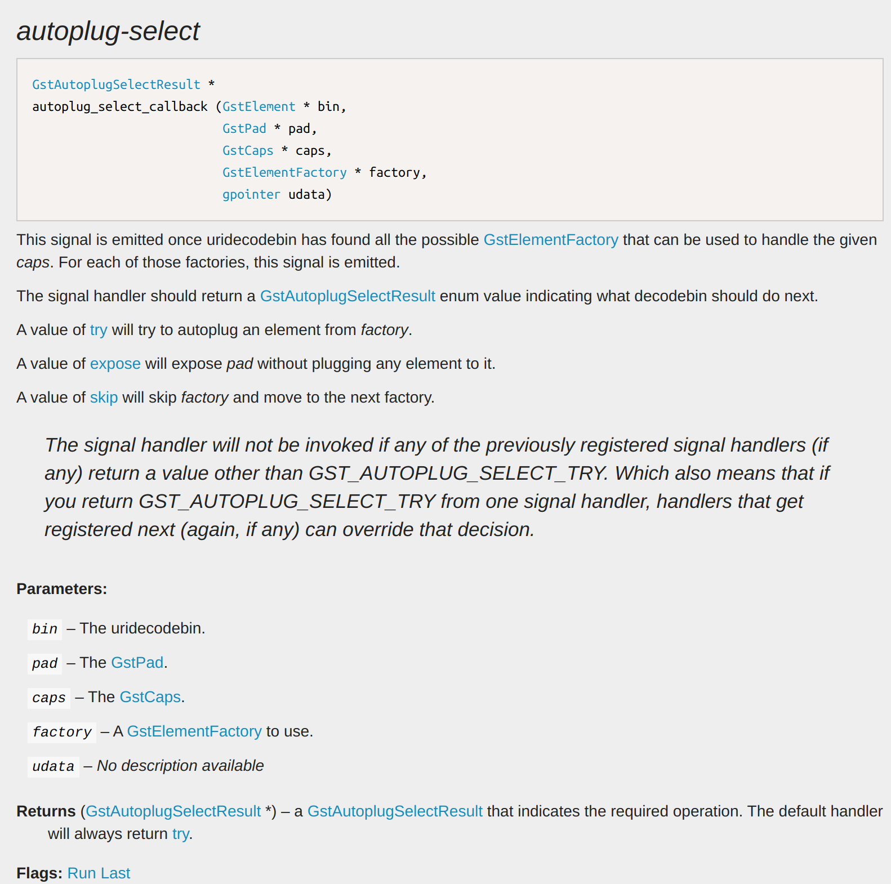

# GStreamer源码剖析——uridecodebin（1）

> How to enable software decoder with uridecedebin.

**前言：**Gstreamer中的`uridecodebin`插件使用非常方便，可根据给定的uri，自动选择合适的不同媒体解封装组件和音视频解码器，从而屏蔽了不同媒体的封装类型和解码器的类型。查阅uridecodebin的文档，可以知道`uridecodebin`在选择满足需求的插件的时候，会按照插件的rank值高低，选择高rank值的插件，而通常而言硬解的rank被定义为primer(256) + 1，比软解rank更高，因此在存在硬解的平台上，`uridecedebin`会优先选择硬解。但是为了能够进一步压榨硬件性能，跑更多路码流，所以希望将软解也应用上，但又不想单独再维护一条新的pipeline，于是考虑到整个应用的其他部分大致相同（可复用），开始调研`uridecodebin`使用软解的方法。

### force-sw-decoders

根据官方文档[uridecodebin](https://gstreamer.freedesktop.org/documentation/playback/uridecodebin.html?gi-language=c#uridecodebin:force-sw-decoders)可以看到，官方已经为`uridecodebin`实现了软解的使能接口，只需要将`force-sw-decoders`属性设为true即可。但是我的开发板是Ubuntu18.04，推荐的GStreamer版本是14.05，我使用`gst-inspect-1.0`工具查看`uridecodebin`是不存在`force-sw-decoders`属性的，于是我就去GitLab上对比了1.18和1.14的`uridecodebin`源码，发现这个属性是在1.18版本才开始支持的，所以需要另辟蹊径。于是我找到`force-sw-decoders`属性的相关核心代码，如下所示：

```c
/* Must be called with factories lock! */
static void
gst_uri_decode_bin_update_factories_list (GstURIDecodeBin * dec)
{
  guint32 cookie;
  GList *factories, *tmp;

  cookie = gst_registry_get_feature_list_cookie (gst_registry_get ());
  if (!dec->factories || dec->factories_cookie != cookie) {
    if (dec->factories)
      gst_plugin_feature_list_free (dec->factories);
    factories =
        gst_element_factory_list_get_elements
        (GST_ELEMENT_FACTORY_TYPE_DECODABLE, GST_RANK_MARGINAL);

    if (dec->force_sw_decoders) {
      /* filter out Hardware class elements */
      dec->factories = NULL;
      for (tmp = factories; tmp; tmp = g_list_next (tmp)) {
        GstElementFactory *factory = GST_ELEMENT_FACTORY_CAST (tmp->data);
        if (!gst_element_factory_list_is_type (factory,
                GST_ELEMENT_FACTORY_TYPE_HARDWARE)) {
          dec->factories = g_list_prepend (dec->factories, factory);
        } else {
          gst_object_unref (factory);
        }
      }
      g_list_free (factories);
    } else {
      dec->factories = factories;
    }

    dec->factories =
        g_list_sort (dec->factories, gst_playback_utils_compare_factories_func);
    dec->factories_cookie = cookie;
  }
}
```

关注第21行开始的代码，当我们希望`uridecedebin`使用软解时，会通过`gst_element_factory_list_is_type (factory, GST_ELEMENT_FACTORY_TYPE_HARDWARE)`来将硬解码器从`uridecodebin`的autoplug-fatories中过滤掉。

### autoplug-sort

上面说到`uridecodebin`的`force-sw-decoders`是从解码器候选列表中过滤掉所有的硬解码器，那么我们是否可以在自己的Pipeline中实现相同的操作呢，答案是肯定的。



从图中红框的描述可以知道，`autoplug-sort`信号允许用户重定义（新增或过滤）原有的`autoplug-factories`列表中的插件，并返回给`uridecedebin`，从而使得`uridecedebin`根据新的插件候选列表进行pipeline的构造。

### autoplug-select



当uridecodebin准备选择某个插件的时候会发出`autoplug-select`信号，这里如果返回是`GST_AUTOPLUG_SELECT_TRY`，则uridecodebin会选择该插件，如果返回是`GST_AUTOPLUG_SELECT_SKIP`，则uridecodebin会跳过该插件，选择下一个满足条件的插件。

注1：截图中的返回值类型的`GstAutoplugSelectResult *`是错误的，正确的返回值是`GstAutoplugSelectResult`。

注2：`GstAutoplugSelectResult`被定义在`gst-plugins-base/gstplayback/gstplay-enum.h`头文件中，但这个头文件不属于GStreamer的开发包内容，所以需要用户自定一个相同的枚举类型。

### 后记

`uridecodebin`使用软解的问题得到解决了，但是在替换插件的时候不能仅从单个插件的角度来考虑，我们必须清楚将硬解替换成软解是否会影响整条pipeline甚至是整个应用程序的运行。因为表面上你替换掉的只是一个解码器插件，但实际不同的插件由于内部实现不同，会对整条pipeline产生影响，尤其是在应用开发过程中，硬解这类与硬件相关的插件，往往使用的内存不是普通内存，导致应用在实现伊始就可能就为了硬解做了相应的适配，所以很可能虽然你能够替换解码器，但会影响到应用其他部分的正常运行。